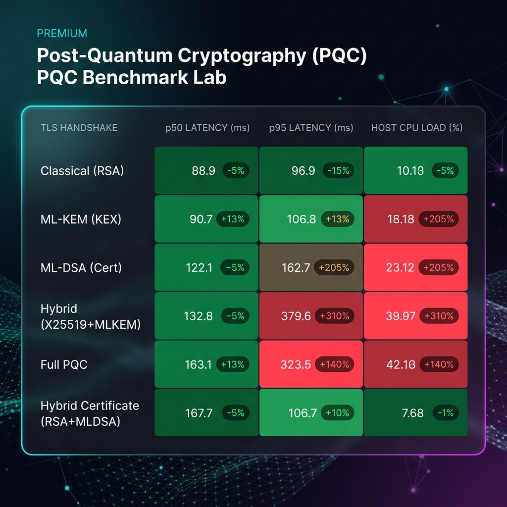
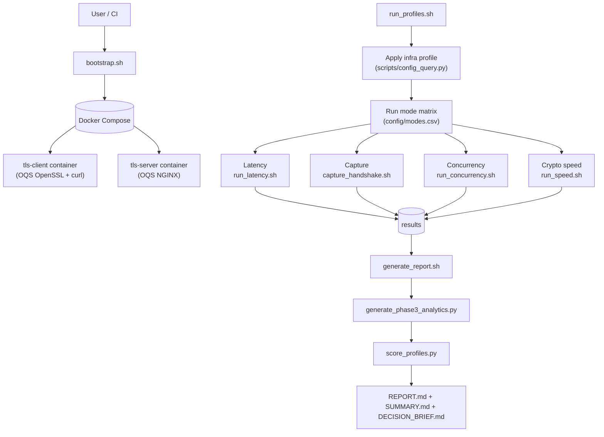

# TLS + PQC Benchmark Lab

A reproducible benchmarking lab for evaluating TLS migration paths across:

- classical cryptography,
- hybrid classical+PQC,
- pure post-quantum cryptography (PQC).

This project helps teams move from one-off tests to repeatable evidence-based rollout decisions.

---

## Table of Contents

- [Featured Analysis (April 2026)](#featured-analysis-2026-pqc-handshake-benchmarks)
- [Why this lab exists](#why-this-lab-exists)
- [What is OQS and why it is used](#what-is-oqs-and-why-it-is-used)
- [Key capabilities](#key-capabilities)
- [Repository structure](#repository-structure)
- [Prerequisites](#prerequisites)
- [Quick Start](#quick-start)
- [Beginner Guide](#beginner-guide-first-30-minutes)
- [Intermediate Guide](#intermediate-guide-repeatable-engineering-benchmarks)
- [Advanced Guide](#advanced-guide-decisioning-regression-gates-and-ci)
- [System Architecture](#system-architecture)
- [How to interpret outputs](#how-to-interpret-outputs)
- [Configuration reference](#configuration-reference)
- [CI workflows](#ci-workflows)
- [Troubleshooting](#troubleshooting)
- [Reproducibility checklist](#reproducibility-checklist)
- [Extra tooling](#extra-tooling-pqc-playground-and-interop)
- [License](#license)
- [Security and risk notice](#security-and-risk-notice)

---

## Featured Analysis: 2026 PQC Handshake Benchmarks

A detailed example analysis of TLS handshake performance comparing Classical vs. Hybrid vs. Full PQC modes.



> [!TIP]
> View the full technical breakdown, including raw cryptographic speed benchmarks and transition recommendations, in the **[April 2026 Analysis Report](./docs/ANALYSIS_REPORT_2026.md)**.

---

## Why this lab exists

Organizations preparing for post-quantum cryptography need to answer practical questions:

- What is handshake overhead for each migration mode?
- Is overhead network-dominated or crypto-compute-dominated?
- What fails under constrained profiles?
- Which mode is best for current rollout, not only future target state?

This lab provides repeatable data with profile emulation, multi-session runs, acceptance gates, scoring, trend exports, and CI automation.

---

## What is OQS and why it is used

**OQS (Open Quantum Safe)** provides PQC algorithms and integrations (including OpenSSL-enabled stacks) for practical migration testing before broad platform defaults are available.

This repository uses OQS-enabled Docker images for client/server paths so the same harness can benchmark:

- classical,
- hybrid,
- PQC

in a comparable framework.

---

## System Architecture

The following diagram illustrates the lab workflow from initialization through to analytical outputs:



---


## Key capabilities

### 1) Infrastructure profile emulation

Profiles in `config/infra_profiles.csv` are applied via network shaping (`tc`) and container limits.

Current profiles:

- `dc_lan`
- `cross_region`
- `mobile_edge`
- `constrained_cpu`
- `burst_gateway`

### 2) Config-driven TLS mode matrix

Modes in `config/modes.csv` are auto-discovered (enabled rows only):

- `classical`
- `kex_pqc`
- `cert_pqc`
- `hybrid`
- `pqc`
- `hybrid_pqc_cert`

### 3) Suite + workload abstraction

- Workloads in `config/workloads.csv`
- Suites in `config/suites.csv`
- Runner: `scripts/run_suite.sh`

This decouples run orchestration from hardcoded shell args.

### 4) Run isolation and traceability

Every run is isolated under a unique run ID:

- `results/runs/<run-id>/...`

And indexed globally:

- `results/runs/index.csv`
- `results/latest-run.txt`

### 5) Reporting and analytics

Per-run outputs include:

- `SUMMARY.md`
- `summary.csv`
- `heatmap-p95.csv`
- `compatibility-status.csv`
- `ACCEPTANCE.md`
- `statistical-summary.csv`
- `handshake-size-breakdown.csv`
- `DECISION_BRIEF.md`
- `decision-scores.csv`

### 6) Acceptance gates and regression guards

`check_acceptance.py` evaluates:

- handshake success thresholds,
- hybrid overhead thresholds,
- compatibility blockers,
- optional baseline regression limits.

Thresholds are controlled in `config/slo.env`.

### 7) Decision scoring

`score_profiles.py` ranks modes using weighted criteria from `config/scoring_profiles.yaml`:

- performance
- compatibility
- resource cost
- handshake size
- security policy fit

### 8) Trend export for dashboards

`export_trends.py` builds historical CSVs from `results/runs/index.csv`:

- latency timeseries
- compatibility timeseries
- run overview timeseries

### 9) CI automation

GitHub Actions run smoke/full suites and upload report artifacts:

- `.github/workflows/bench-smoke.yml`
- `.github/workflows/bench-full.yml`

### 10) PQC ecosystem tooling

Includes algorithm catalog, executable matrix generation, playground vectors, and interop harness.

---

## Repository structure

```text
.
├── config/
│   ├── infra_profiles.csv
│   ├── modes.csv
│   ├── workloads.csv
│   ├── suites.csv
│   ├── slo.env
│   └── scoring_profiles.yaml
├── docs/
│   ├── pqc_playground.md
│   ├── pqc_interop.md
│   └── adapter_contract.md
├── schema/
│   └── run_result.json
├── scripts/
│   ├── run_suite.sh
│   ├── run_profiles.sh
│   ├── validate_config.py
│   ├── generate_profiles_report.py
│   ├── generate_phase3_analytics.py
│   ├── check_acceptance.py
│   ├── score_profiles.py
│   ├── export_trends.py
│   ├── lab_doctor.sh
│   ├── playground.sh
│   ├── interop.sh
│   └── ...
├── vectors/
│   ├── README.md
│   ├── kem/
│   ├── sig/
│   └── catalog/
└── results/
    ├── runs/
    └── trends/
```

---

## Prerequisites

- Docker Desktop (with Compose support)
- Python 3
- `openssl`
- Optional: Wireshark
- Optional: `tshark` (for handshake message-level sizing)

---

## Quick Start

```bash
./scripts/bootstrap.sh
./scripts/lab_doctor.sh
./scripts/run_profiles.sh 3 50 5 off
```

Open latest reports:

```bash
RUN_ID="$(cat results/latest-run.txt)"
open "results/runs/${RUN_ID}/reports/SUMMARY.md"
open "results/runs/${RUN_ID}/reports/ACCEPTANCE.md"
```

---

## Beginner Guide (first 30 minutes)

### Goal

Run one fast benchmark and learn where decisions come from.

### Steps

1. Validate environment:
   ```bash
   ./scripts/lab_doctor.sh
   ```

2. Run smoke suite:
   ```bash
   ./scripts/run_suite.sh --suite quick --sessions 1
   ```

3. Open generated reports:
   ```bash
   RUN_ID="$(cat results/latest-run.txt)"
   open "results/runs/${RUN_ID}/reports/ACCEPTANCE.md"
   open "results/runs/${RUN_ID}/reports/SUMMARY.md"
   ```

### What to read first

- `ACCEPTANCE.md`: Go/No-Go outcome.
- `SUMMARY.md`: profile x mode behavior and deltas.
- `summary.csv`: machine-readable data for charting.

### Mental model

- If acceptance fails: use results diagnostically, not as rollout recommendation.
- If acceptance passes: compare tradeoffs, then move to scoring.

---

## Intermediate Guide (repeatable engineering benchmarks)

### Goal

Run stable experiments you can compare across releases and environments.

### 1) Validate config before long runs

```bash
python3 scripts/validate_config.py
```

### 2) Run broad suite with deterministic seed

```bash
./scripts/run_suite.sh --suite broad_coverage --seed 1337 --run-id-prefix team-baseline
```

### 3) Run resumption OFF/ON comparison

```bash
./scripts/run_resumption_ab.sh 1 50 5
```

### 4) Tune scenarios from config

- Enable/disable modes: `config/modes.csv`
- Profile behavior: `config/infra_profiles.csv`
- Workload intensity and behavior: `config/workloads.csv`
- Suite composition: `config/suites.csv`

### 5) Export trends for dashboards

```bash
python3 scripts/export_trends.py --runs-index results/runs/index.csv --output-dir results/trends
```

---

## Advanced Guide (decisioning, regression gates, and CI)

### Goal

Operationalize benchmark governance: ranking, regression control, CI quality gates.

### 1) Create decision brief

```bash
python3 scripts/score_profiles.py \
  --summary-csv results/runs/<run-id>/reports/summary.csv \
  --compat-csv results/runs/<run-id>/reports/compatibility-status.csv \
  --preset balanced \
  --output-md results/runs/<run-id>/reports/DECISION_BRIEF.md \
  --output-csv results/runs/<run-id>/reports/decision-scores.csv
```

Available presets are defined in `config/scoring_profiles.yaml`:
- `low-latency-edge`
- `constrained-compute`
- `compatibility-first`
- `balanced`

### 2) Enforce regression guards against baseline

```bash
python3 scripts/check_acceptance.py \
  --results-dir results/runs/<run-id> \
  --report-dir results/runs/<run-id>/reports \
  --slo-file config/slo.env \
  --baseline-summary-csv results/trends/baseline_smoke_summary.csv \
  --baseline-compat-csv results/trends/baseline_smoke_compatibility.csv
```

### 3) Build capability-aware executable matrix

```bash
./scripts/catalog.sh snapshot --backends openssl,liboqs,python
python3 scripts/build_matrix.py \
  --capabilities results/catalog/<timestamp>/capabilities.json \
  --families kem,sig \
  --backends openssl,liboqs,python \
  --min-level 1 \
  --output results/catalog/<timestamp>/matrix.csv
```

### 4) Integrate CI workflows

- PR smoke suites: `.github/workflows/bench-smoke.yml`
- Nightly/weekly full suites: `.github/workflows/bench-full.yml`

---

## How to interpret outputs

Use this order:

1. `ACCEPTANCE.md`
   - PASS/FAIL gate for policy thresholds and blockers.

2. `SUMMARY.md`
   - Executive behavior and deltas by profile/mode.

3. `DECISION_BRIEF.md`
   - Weighted ranking for rollout recommendation context.

4. CSV artifacts
   - `summary.csv`, `heatmap-p95.csv`, `statistical-summary.csv`, trend exports.

Decomposition heuristics:

- KEX effect = `kex_pqc - classical`
- Certificate effect = `cert_pqc - classical`
- Combined PQC effect = `pqc - classical`
- Migration overhead = `hybrid - classical`

---

## Configuration reference

### `config/modes.csv`
Mode catalog (enabled rows are benchmarked automatically).

### `config/infra_profiles.csv`
Network/resource emulation profiles and profile concurrency defaults.

### `config/workloads.csv`
Benchmark intensity and behavior (runs, warmup, parallelism, load pattern, keepalive mix, mode ordering).

### `config/suites.csv`
Named suite composition linking workload + profile/mode filters + seed strategy.

### `config/slo.env`
Acceptance and regression threshold configuration.

### `config/scoring_profiles.yaml`
Weighted decision presets and policy target levels.

---

## CI workflows

### `bench-smoke.yml`

Runs fast suites on PR and manual trigger, executes regression gates, uploads reports.

### `bench-full.yml`

Runs nightly/weekly broader suites and publishes artifacts for trend analysis.

---

## Troubleshooting

If algorithm names differ from expected image build:

```bash
docker exec tls-client openssl list -groups
docker exec tls-client openssl list -kem-algorithms
docker exec tls-client openssl list -signature-algorithms
```

If environment checks fail:

```bash
./scripts/lab_doctor.sh
python3 scripts/validate_config.py
```

If run outputs look inconsistent:

- verify fixed seed usage (`--seed` or `RUN_SEED`)
- ensure stable host load during run windows
- confirm pinned image digests in `docker-compose.yml`

---

## Reproducibility checklist

- Keep images pinned by digest (`docker-compose.yml`)
- Keep explicit SLO thresholds (`config/slo.env`)
- Use run-scoped artifacts (`results/runs/<run-id>`)
- Run at least 3 sessions for stable medians
- Validate configs before runs (`scripts/validate_config.py`)
- Use deterministic seeds for mode ordering reproducibility

---

## Extra tooling (PQC playground and interop)

### Playground

Use `scripts/playground.sh` for backend algorithm checks and comparisons.

See `docs/pqc_playground.md`.

### Interop harness

Use `scripts/interop.sh` + `scripts/interop_runner.py` for cross-backend interop validation and negative tests.

See:
- `docs/pqc_interop.md`
- `docs/adapter_contract.md`

### Vectors and catalog

- Deterministic support vectors: `vectors/README.md`
- Algorithm metadata catalog: `vectors/catalog/algorithms.json`

---

## License

Apache-2.0. See `LICENSE`.

---

## Security and risk notice

This project is for benchmarking and research workflows. Validate findings in your own production-like environment before any migration or rollout decision.
